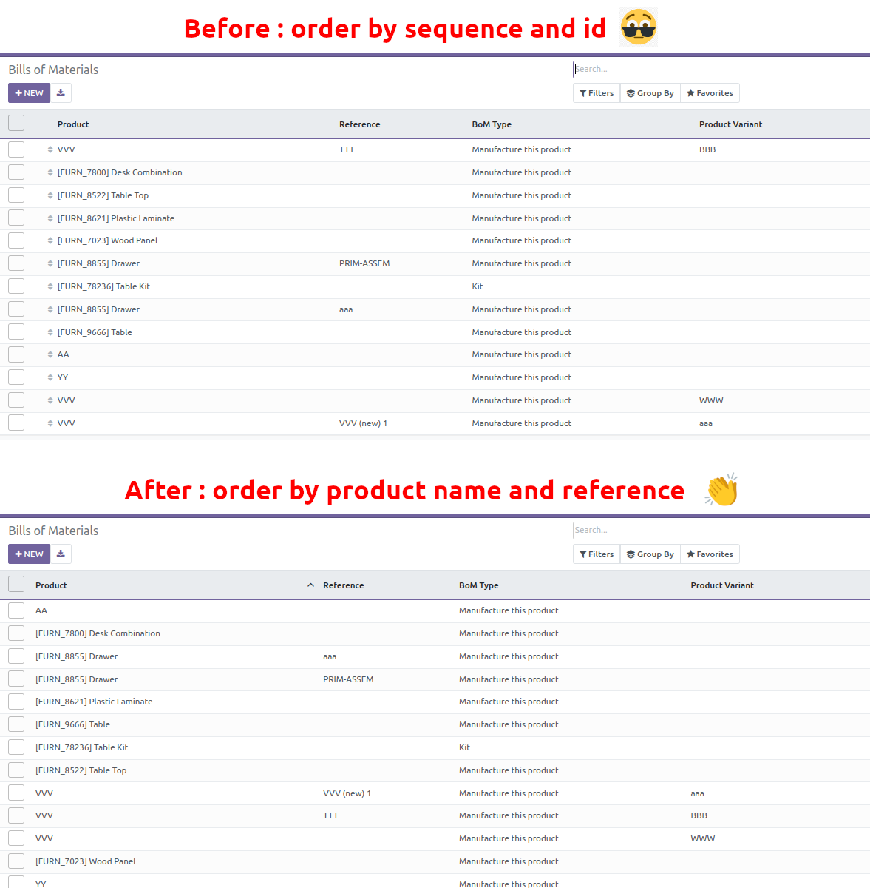

Default BoM Order is weird : sequence and id. This module changes it and change
order in BoM tree view with :Product template name, then product variant name,
then their code.
It hides sequence as it is not used anymore.

