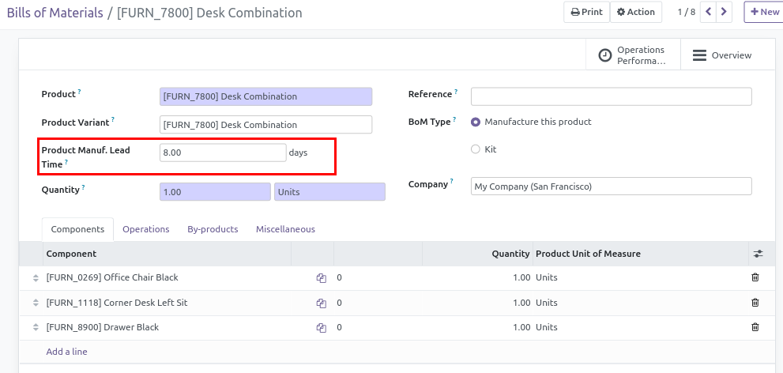

This module is designed to better respond to the flow of certain users who think
about their production time when creating a bill of materials.

It adds `Produce Delay` in BoM.
Changes in BoM field will affect Product `Produce Delay`.
It works better on single-BoM-per-Product context : indeed changing `Produce Delay` 
on BoM-A will change the value on BoM-B.

