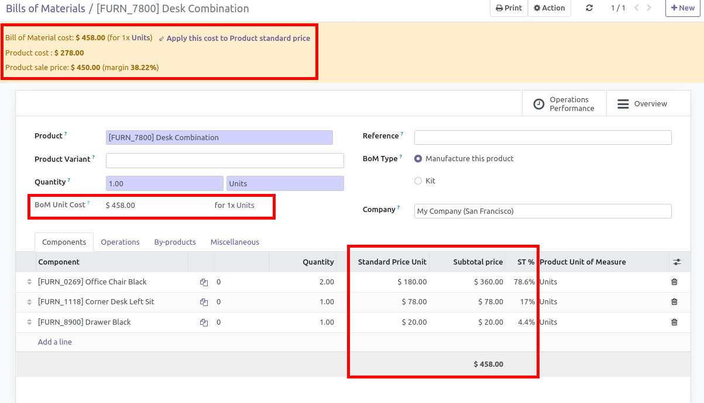
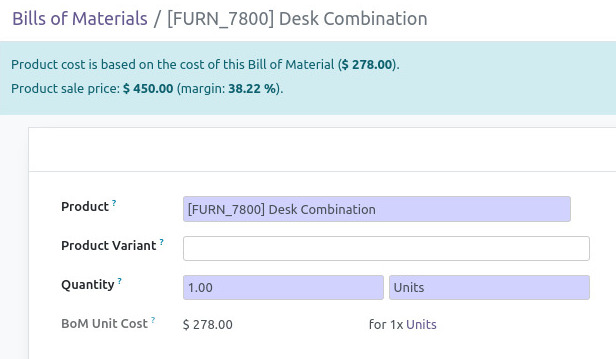
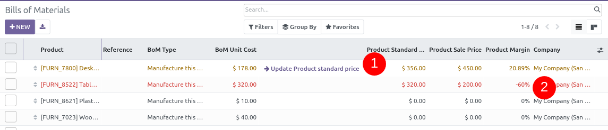

Change BoM quantity or BoM lines quantity or price in one component. See
new panel to change Product Standard Price.

> 
>
> 

In tree view, quickly see difference between Product standard price and
BoM cost. You can also change Product standard price here Lines are red
when Sale margin in negative.

On the Bill of Material form, use the **Cost basis** field (next to the
BoM Unit Cost) to choose how the cost is computed:

- Keep it on **Direct** to cost only this BoM level, summing each
  component's own standard price. This is the historical behaviour and
  is best when you maintain costs bottom-up, level by level.
- Switch it to **Rolled-up** to recurse through every sub-BoM and add
  the operation / work-center costs (based on each operation's manual
  duration and its work center hourly cost) in a single pass. Components
  that have no BoM of their own fall back to their standard price.

The currently selected basis is always visible on the form, and the BoM
Unit Cost, the component subtotals and the margin information all
reflect it.
