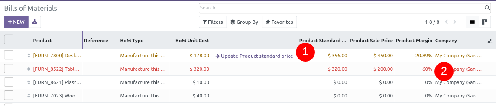

Set Product Variant in your Bill of Material.
Change BoM quantity or BoM lines quantity or price in one component.
See new panel to change Product Variant Standard Price.

 .. figure:: ../static/mrp_bom_product_price_margin_diff.png

 .. figure:: ../static/mrp_bom_product_price_margin_no_diff.png

In tree view, quickly see difference between Product standard price and BoM cost.
You can also change Product standard price here
Lines are red when Sale margin in negative.

