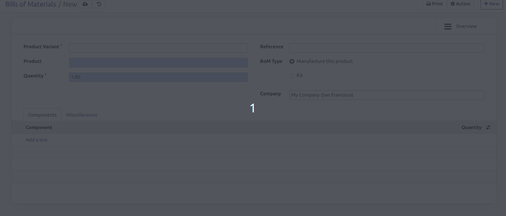

This module is designed so that the user selects the product variant when
creating or updating a Bill of Material.
When selecting a product variant, the linked product template is
automatically selected.

Tree and filter view are also changed : you see and search with product variant.

