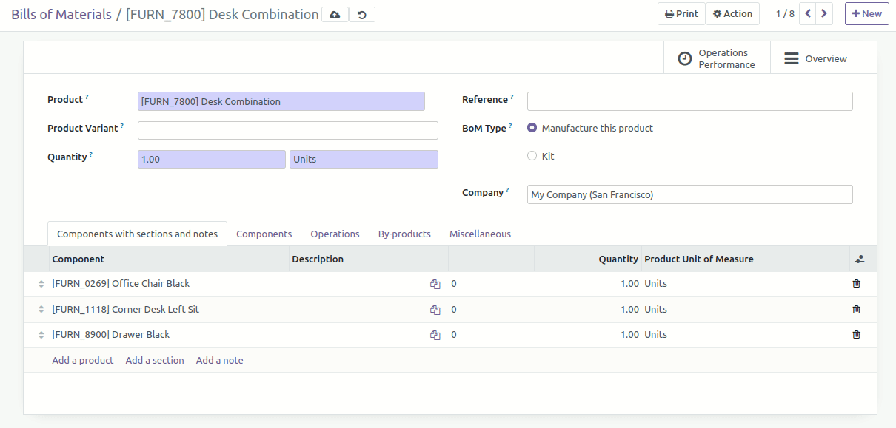

* Go to Manufacture / Master Data / Bill Of Materials
* Edit one demo data
* Add a section or note and saved
* The new functionality is added in a transparent way and is compatible with the business logic of other MRP functionalities

