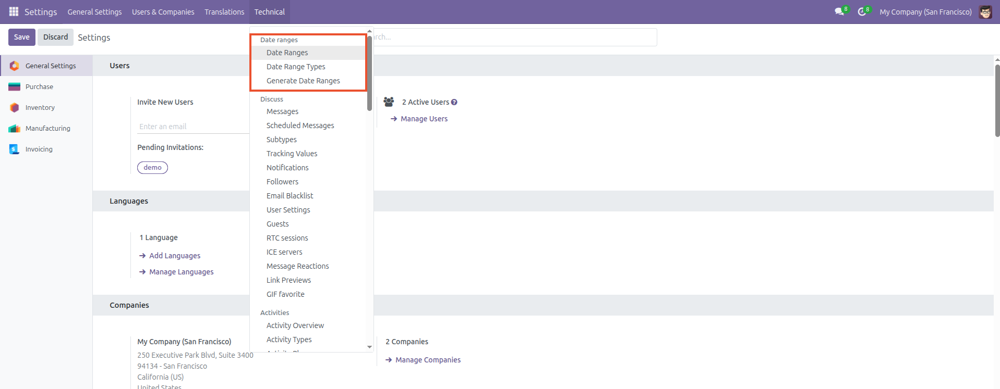
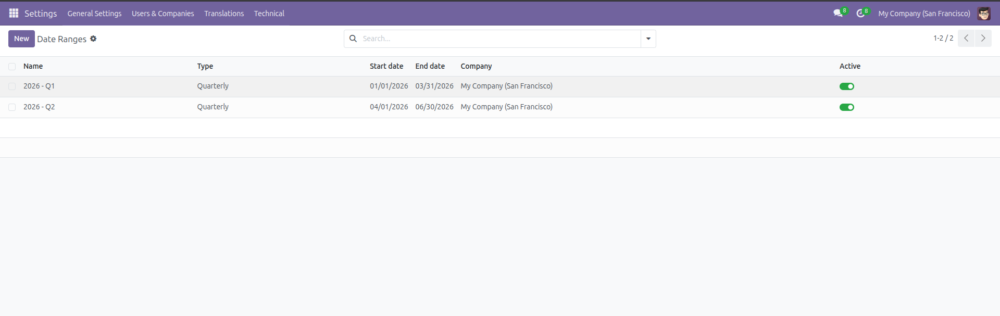
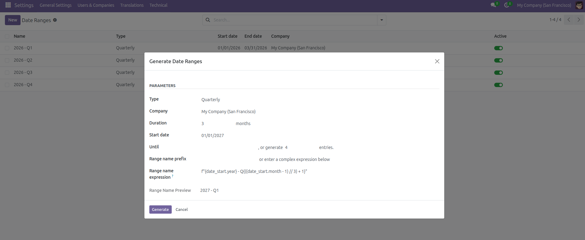
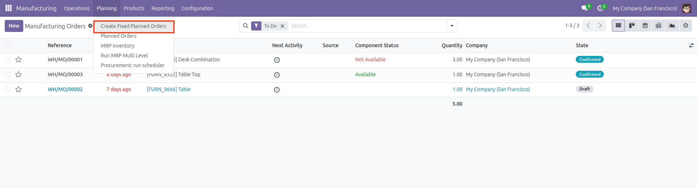
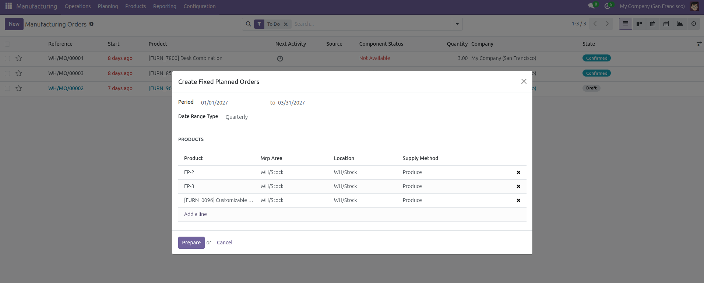
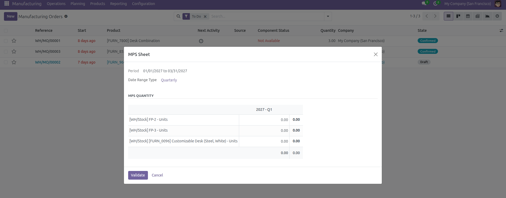
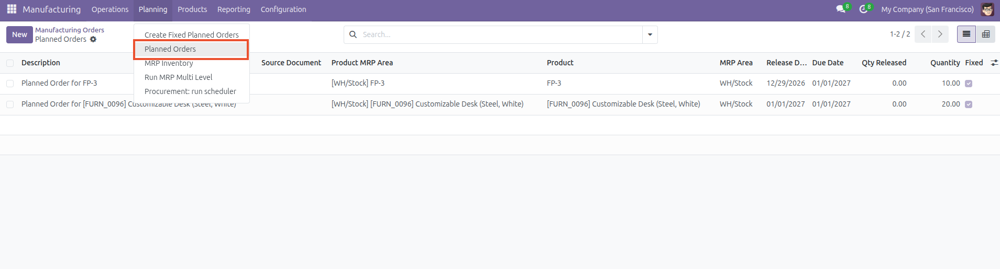
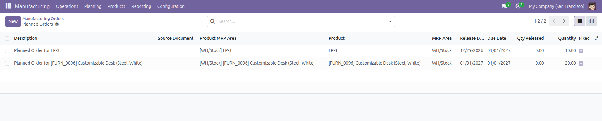

- Go to *Settings / Technical / Date ranges / Date Ranges* and define your
  estimating periods.

- Date Ranges View

- Generate Date Ranges View

- Go to *Manufacturing / Planning / Create Fixed Planned Orders* to
  create or update your fixed planned orders.

- Create Fixed Planned Orders Matrix Wizard

- Go to *Manufacturing / Planning / Planned Orders* to review the
  planned orders in the system.

