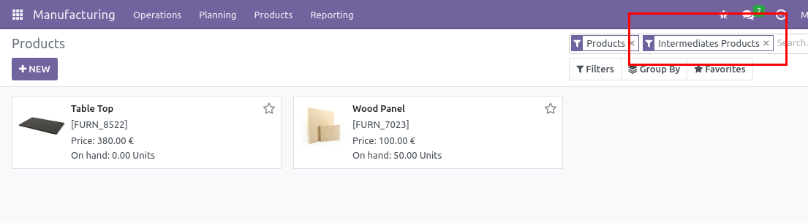

Adds characterisation "Intermediate Products" and adjust Components characterisation.

Intermediate products : contained in a BoM AND manufactured (has a BoM)
Component products : contained in a BoM AND NOT manufactured (has no BoM)

For example in bakeries, leavening is a intermediate product, and buckwheat flour
a component product.

