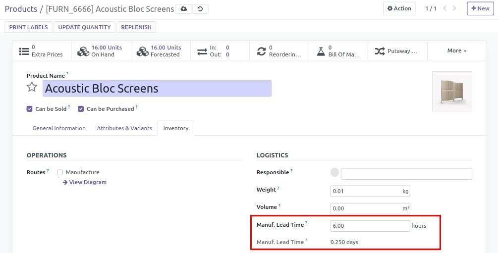

This module is designed to handle Product Produce Delay in hours.
By default, Odoo only accepts Produce delay in days, but it's not suitable for
all types of activity, such as artisanal food processing, where this
information can be used for a BoM as a recipe.

