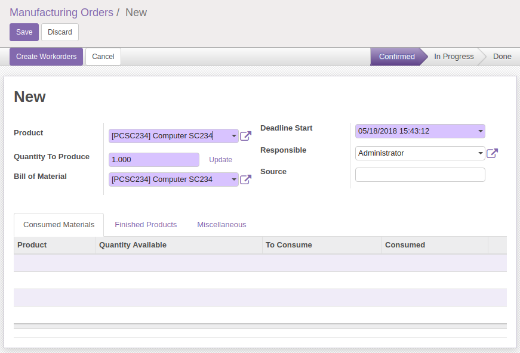
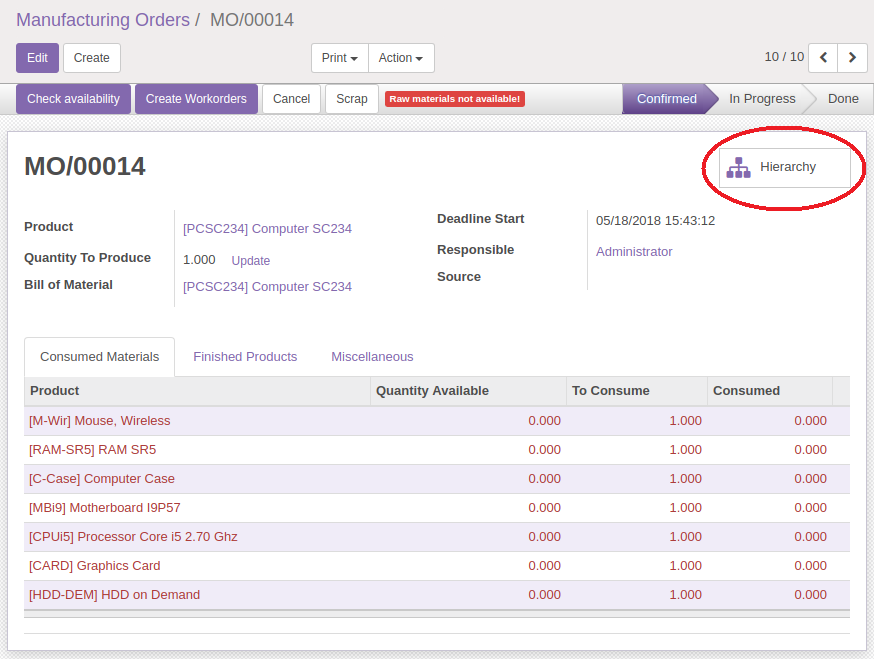
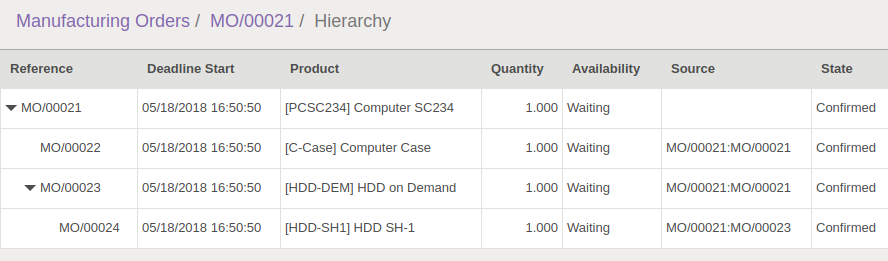

Create a new production order (Manufacture / Operations / Manufacturing Orders)
with a multi-levels nomenclatured product, and related products configured with
'Manufacture' and 'Make To Order' routes:

Once saved, click on the 'Hierarchy' button at right:

