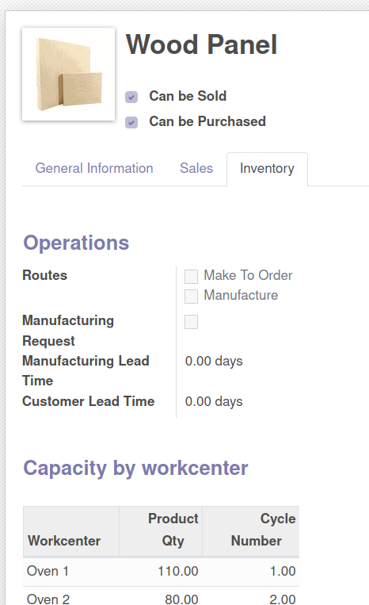

To configure a product to automatically compute Manufacturing Requests quantity you need to:

#. Create some workcenters: go to Manufacturing settings, tick work order and click on Workcenter.
#. Go to the products variants.
#. Go to the *Inventory* tab.
#. Fill **Capacity by workcenter** section.

