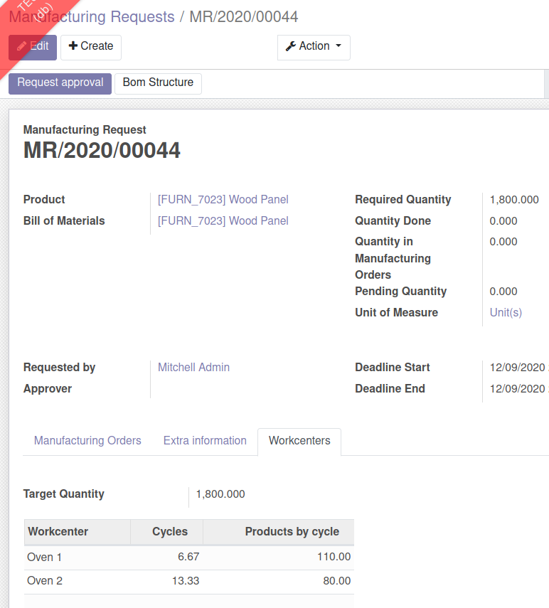

To use this module, you need to:

#. Go to *Manufacturing > Manufacturing Requests*.
#. Create a manufacturing request using the product configured with workcenter (Wood Panel in demo data)
#. Fill Target Quantity field and save MR
#. Click on 'Request Approval' button
#. 'Approve' the Manufacturing Request
#. Click on 'Create Manufacturing Orders' button

Check created MOs

